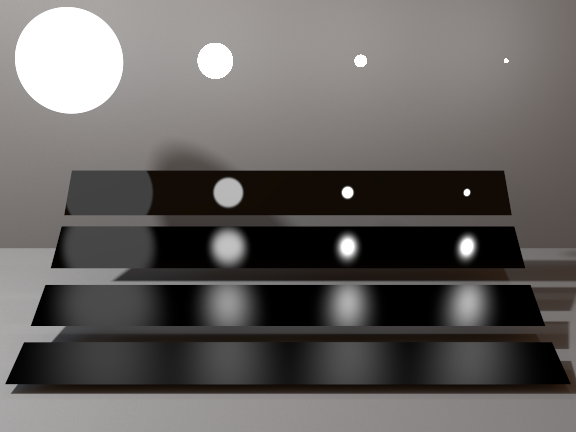

# Pathed-GPU

## Overview
* Forward GPU path tracer with two backends: vanilla CUDA and OptiX 7
* Triangle and sphere primitives; diffuse, mirror, glass, and Beckmann microfacet brdfs; importance-sampled environment lighting
* Fully interactive, with the ability to move the camera, dynamically change materials, and change render settings such as next event estimation
* Scene interaction instrumented through Python via `pybind11` bindings

## Features
### Live visualization


### Configurable materials


### Next event estimation with multiple importance sampling


## Build instructions
```
git clone --recursive https://github.com/chellmuth/gpu-pathed.git
cd gpu-pathed
pip install -r requirements.txt
mkdir build
cd build
export OPTIX_INSTALL_DIR=/path/to/optix
cmake -DCMAKE_BUILD_TYPE=Release -DOptiX_INSTALL_DIR="${OPTIX_INSTALL_DIR}" ..
make
PYTHONPATH=. python ../pathed.py
```
